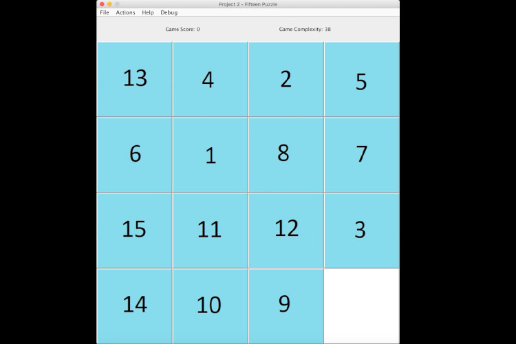
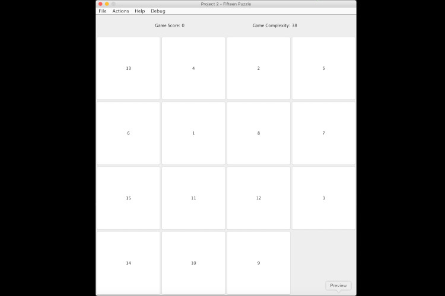
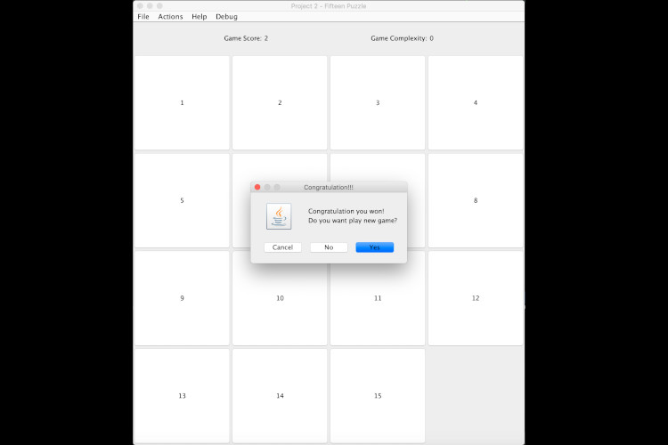

# fifteen-puzzle
Fifteen Puzzle

The Fifteen Puzzle is one variation of the N-Puzzle. The Fifteen Puzzle was made famous by Sam Lloyd who in 1878. To solve the puzzle, a number that is next to the empty position is moved into the empty position. By 'next to', the number can be above, below, to the left or to the right of the empty position. The empty position will now occupy the grid position were the number had been.

Also, the user can select own picture that will be spit to 15 pieces in order to solve puzzle using parts of picture. Then, the user has ability to debug this application using "Debug" menu and undo moves. When puzzle is solved, message are shown to select new game or exit the application.

